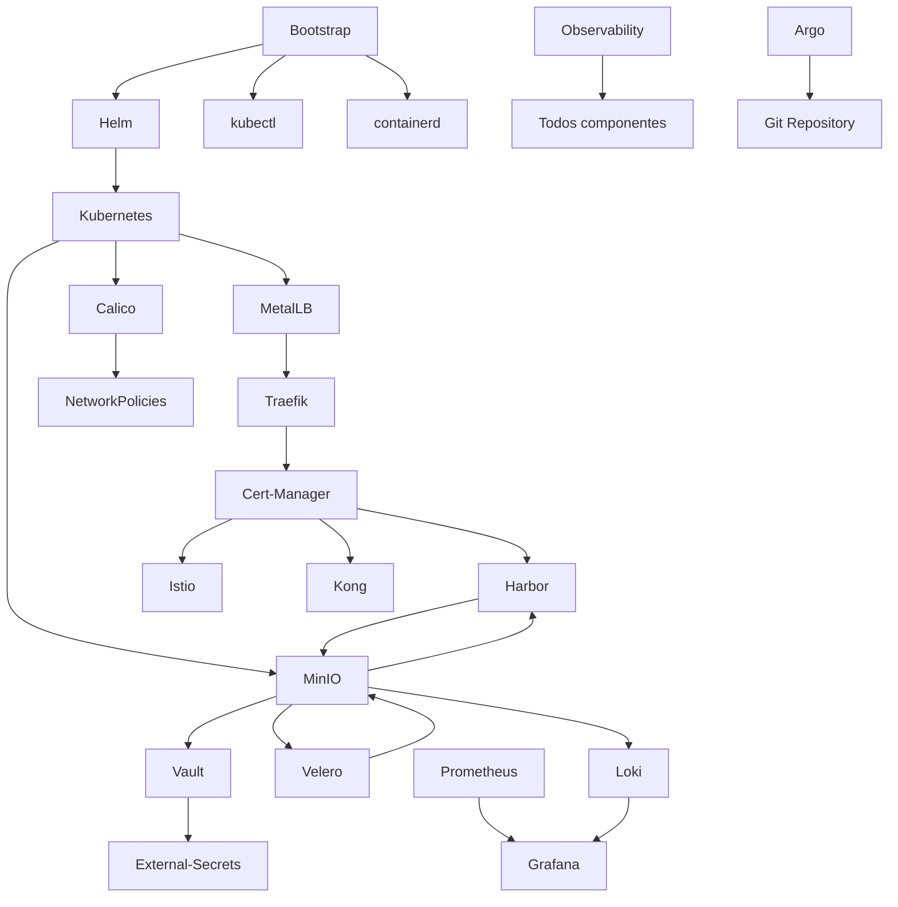

# Guia de Ferramentas — Raijin Server

> Documentação técnica completa dos componentes da infraestrutura Kubernetes gerenciada pelo Raijin Server CLI.

## Visão Geral

Este guia cobre a instalação, configuração, operação e troubleshooting de todos os componentes instalados pelo **Raijin Server** em clusters Kubernetes (bare metal/VM Ubuntu 20.04+).

### Arquitetura em Camadas

```
┌─────────────────────────────────────────────────────────────┐
│                    External Access Layer                    │
│   VPN Client → DNS → Cert-Manager → Traefik (Ingress)       │
└─────────────────────────────────────────────────────────────┘
                              ↓
┌─────────────────────────────────────────────────────────────┐
│                    Application Layer                        │
│   Harbor (Registry) → Apps Namespace → NetworkPolicies      │
└─────────────────────────────────────────────────────────────┘
                              ↓
┌─────────────────────────────────────────────────────────────┐
│                    Platform Layer                           │
│   Calico (CNI) → MinIO (S3) → Vault (Secrets) → Velero      │
└─────────────────────────────────────────────────────────────┘
                              ↓
┌─────────────────────────────────────────────────────────────┐
│                  Observability Layer                        │
│   Prometheus → Grafana → Loki → Alertmanager                │
└─────────────────────────────────────────────────────────────┘
```

---

## 📚 Documentação por Componente

### Core Infrastructure

| Componente | Descrição | Tipo | Docs |
|------------|-----------|------|------|
| **[Kubernetes](kubernetes.md)** | Cluster K8s via kubeadm + containerd + etcd | Core | ⭐⭐⭐ |
| **[Helm](helm.md)** | Package manager para Kubernetes (charts) | Core | ⭐⭐⭐ |
| **[Bootstrap](bootstrap.md)** | Instalação de ferramentas base (helm, kubectl, istioctl, velero) | Core | ⭐⭐⭐ |

### Rede e Conectividade

| Componente | Descrição | Tipo | Docs |
|------------|-----------|------|------|
| **[Calico](calico.md)** | CNI (Container Network Interface) + NetworkPolicies L3/L4 | Network | ⭐⭐⭐ |
| **[MetalLB](metallb.md)** | LoadBalancer para bare-metal (Layer 2 / BGP) | Network | ⭐⭐⭐ |
| **[Traefik](traefik.md)** | Ingress Controller L7 (HTTP/HTTPS routing) | Network | ⭐⭐⭐ |
| **[Cert-Manager](cert-manager.md)** | TLS automático (Let's Encrypt + ACME) | Network | ⭐⭐⭐ |

### Service Mesh e API Gateway

| Componente | Descrição | Tipo | Docs |
|------------|-----------|------|------|
| **[Istio](istio.md)** | Service mesh (mTLS, traffic shaping, observability) | Mesh | ⭐⭐⭐ |
| **[Kong](kong.md)** | API Gateway (rate limiting, JWT, plugins) | Gateway | ⭐⭐⭐ |

### Segurança e Secrets

| Componente | Descrição | Tipo | Docs |
|------------|-----------|------|------|
| **[Vault](vault.md)** | HashiCorp Vault + External Secrets Operator | Secrets | ⭐⭐⭐ |
| **[Secrets Management](secrets.md)** | Sealed-Secrets + External-Secrets | Secrets | ⭐⭐⭐ |

### Armazenamento e Backup

| Componente | Descrição | Tipo | Docs |
|------------|-----------|------|------|
| **[MinIO](minio.md)** | S3-compatible object storage (standalone/distributed) | Storage | ⭐⭐⭐ |
| **[Velero](velero.md)** | Backup e restore de cluster + PVs | Backup | ⭐⭐⭐ |
| **[Harbor](harbor.md)** | Container Registry + Vulnerability Scanning (Trivy) | Registry | ⭐⭐⭐ |

### Observabilidade

| Componente | Descrição | Tipo | Docs |
|------------|-----------|------|------|
| **[Prometheus](prometheus.md)** | Métricas time-series + AlertManager (PromQL) | Monitoring | ⭐⭐⭐ |
| **[Grafana](grafana.md)** | Dashboards, datasources, alerting | Monitoring | ⭐⭐⭐ |
| **[Loki](loki.md)** | Agregação de logs (LogQL, Promtail) | Logging | ⭐⭐⭐ |
| **[Observability Stack](observability.md)** | Stack completo (Prometheus + Grafana + Loki + Alertmanager) | Monitoring | ⭐⭐⭐ |

### CI/CD e GitOps

| Componente | Descrição | Tipo | Docs |
|------------|-----------|------|------|
| **[Argo](argo.md)** | Argo CD (GitOps) + Argo Workflows (CI pipelines) | CI/CD | ⭐⭐⭐ |

### Plataformas e Aplicações

| Componente | Descrição | Tipo | Docs |
|------------|-----------|------|------|
| **[Supabase](supabase.md)** | Open Source Firebase Alternative (PostgreSQL + Auth + Realtime + Storage) | BaaS | ⭐⭐⭐ |

---

## 🚀 Início Rápido

### Pré-requisitos

- Ubuntu 20.04+ (bare metal ou VM)
- 4GB+ RAM, 2+ CPU cores
- 50GB+ storage (NVMe/SSD recomendado)
- Python 3.8+

### Instalação do CLI

```bash
python3 -m venv ~/.venvs/raijin
source ~/.venvs/raijin/bin/activate
pip install raijin-server
```

### Ordem de Instalação Recomendada

```bash
# 0. Bootstrap (ferramentas base)
sudo raijin bootstrap

# 1. Kubernetes + CNI
sudo raijin kubernetes
sudo raijin calico

# 2. LoadBalancer + Ingress + TLS
sudo raijin metallb
sudo raijin traefik
sudo raijin cert-manager

# 3. Storage + Secrets
sudo raijin minio
sudo raijin secrets  # Vault + ESO

# 4. Backup + Registry
sudo raijin velero
sudo raijin harbor

# 5. Observabilidade (detalhada)
sudo raijin prometheus
sudo raijin grafana
sudo raijin loki
# Ou stack completo:
# sudo raijin observability

# 6. Service Mesh / API Gateway (opcional)
sudo raijin istio   # OU
sudo raijin kong

# 7. CI/CD (opcional)
sudo raijin argo
```

---

## 📖 Estrutura da Documentação

Cada guia de componente segue a estrutura padronizada:

### Seções Padrão

1. **O que é**: Descrição técnica e propósito
2. **Por que usamos**: Justificativa na arquitetura Raijin
3. **Como está configurado (V1)**: Detalhes da implementação atual
4. **Como operamos**: Comandos práticos do dia a dia
5. **Manutenção e monitoramento**: Health checks e best practices
6. **Troubleshooting**: Diagnóstico de problemas comuns
7. **Glossário**: Termos técnicos com números sobrescritos¹
8. **Boas práticas ✅**: Recomendações de uso
9. **Práticas ruins ❌**: O que evitar
10. **Diagnóstico avançado**: Comandos detalhados de debug
11. **Referências**: Links oficiais e recursos externos

### Convenções de Notação

- **Termos técnicos**: Marcados com números sobrescritos¹ que linkam para o glossário
- **Comandos**: Blocos de código com contexto
- **Exemplos YAML**: Configurações completas testadas
- **Ícones**:
  - ✅ Boas práticas
  - ❌ Práticas ruins
  - ⚠️ Avisos importantes
  - 💡 Dicas úteis

---

## 🔗 Navegação

### Por Categoria

- **Core**: [Kubernetes](kubernetes.md) → [Helm](helm.md) → [Bootstrap](bootstrap.md)
- **Rede**: [Calico](calico.md) → [MetalLB](metallb.md) → [Traefik](traefik.md) → [Cert-Manager](cert-manager.md)
- **Service Mesh**: [Istio](istio.md) | [Kong](kong.md)
- **Storage**: [MinIO](minio.md) → [Harbor](harbor.md) → [Velero](velero.md)
- **Secrets**: [Vault](vault.md) → [Secrets Management](secrets.md)
- **Observabilidade**: [Prometheus](prometheus.md) → [Grafana](grafana.md) → [Loki](loki.md) | [Stack Completo](observability.md)
- **CI/CD**: [Argo](argo.md) (Argo CD + Argo Workflows)

### Dependências entre Componentes



---

## 🆘 Suporte e Troubleshooting

### Comandos Gerais de Diagnóstico

```bash
# Health check geral
kubectl get nodes
kubectl get pods -A | grep -v Running

# Logs de namespace específico
kubectl logs -n <namespace> -l app=<component> --tail=100 -f

# Eventos recentes
kubectl get events -A --sort-by='.lastTimestamp' | tail -20

# Uso de recursos
kubectl top nodes
kubectl top pods -A
```

### Debug do Raijin CLI

```bash
raijin-server debug kube --namespace <ns> --events 200
raijin-server validate
```

### Fluxo de Troubleshooting

1. **Identificar o componente**: Qual serviço está falhando?
2. **Consultar docs específicas**: Ver seção "Troubleshooting" do componente
3. **Logs e eventos**: `kubectl logs` e `kubectl describe`
4. **Health checks**: Endpoints de health de cada componente
5. **Diagnóstico avançado**: Comandos específicos nas docs

---

## 📝 Convenções de Commits (Docs)

Ao atualizar documentação:

```bash
git commit -m "docs(calico): adicionar exemplo de NetworkPolicy L4"
git commit -m "docs(harbor): corrigir comando de robot account"
git commit -m "docs(observability): adicionar query PromQL para CPU"
```

---

## 🔄 Versionamento

- **Raijin Server**: `>= 0.2.38`
- **Kubernetes**: `1.28+`
- **Documentação**: Sincronizada com releases do CLI

### Changelog de Docs v2.1.0

- **2026-02-03**: Adição de 10 novos componentes documentados
  - **Core**: Kubernetes, Helm, Bootstrap (ferramentas base)
  - **Network**: MetalLB (LoadBalancer bare-metal)
  - **Observability**: Prometheus, Grafana, Loki (detalhados)
  - **Service Mesh**: Istio (mTLS, traffic shaping)
  - **API Gateway**: Kong (plugins, rate limiting)
  - **CI/CD**: Argo (Argo CD + Argo Workflows)
- **2026-02-02**: Reestruturação completa com glossários e navegação
- **2026-01-15**: Migração para docs/tools/
- **2025-12-20**: Adição de observability stack

### Estatísticas

- **Total de componentes documentados**: 19
- **Glossários criados**: 19 (190+ termos técnicos)
- **Exemplos práticos**: 380+
- **Boas práticas**: 285+
- **Anti-patterns**: 285+
- **Linhas de documentação**: ~9000+

---

## 📚 Recursos Adicionais

### Documentação do Projeto

- [ARCHITECTURE.md](../../ARCHITECTURE.md): Visão geral da arquitetura
- [INFRASTRUCTURE_GUIDE.md](../INFRASTRUCTURE_GUIDE.md): Guia de infraestrutura
- [EXAMPLES.md](../../EXAMPLES.md): Exemplos práticos
- [AUDIT.md](../../AUDIT.md): Auditoria de segurança

### Comunidade

- **GitHub**: [raijin-server](https://github.com/username/raijin-server)
- **Issues**: Reportar bugs ou sugerir melhorias
- **Discussions**: Tirar dúvidas da comunidade

---

## 📄 Licença

Este projeto é licenciado sob [LICENSE](../../LICENSE).

---

**Última atualização**: 2026-02-03  
**Mantido por**: Raijin Server Team
